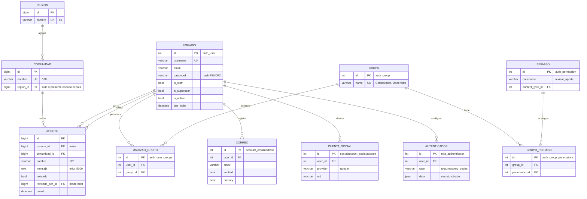

# Modelo Entidad-Relación (3FN)

Modelo de datos de BICSAN. Las tablas de `auth` y `allauth` son las que Django y
django-allauth crean; las de `aportes` son propias del proyecto.

## Justificación de la normalización

| Forma normal | Cómo se cumple |
|---|---|
| **1FN** | Todos los atributos son atómicos: no hay listas ni campos repetidos. Los roles de un usuario se guardan en la tabla intermedia `USUARIO_GRUPO`, no en una columna con varios valores. |
| **2FN** | Todas las tablas usan una clave primaria simple (`id`), así que no puede haber dependencias parciales de una clave compuesta. |
| **3FN** | No hay dependencias transitivas. Antes, `Aporte` guardaba la comunidad como texto libre, y la región dependía de la comunidad, no del aporte. Ahora la región vive en `REGION`, la comunidad en `COMUNIDAD` y el aporte solo guarda `comunidad_id`. Cambiar el nombre de una comunidad o su región se hace en un solo lugar. |

## Reglas de integridad

- `COMUNIDAD.region_id` y `APORTE.comunidad_id` usan `ON DELETE PROTECT`: no se puede borrar una región o comunidad que tenga datos asociados.
- `APORTE.usuario_id` y `APORTE.revisado_por_id` usan `ON DELETE SET NULL`: si se elimina una cuenta, el aporte cultural se conserva.
- `REGION.nombre` y `COMUNIDAD.nombre` son únicos para evitar duplicados.
- `APORTE.nombre` (120) y `APORTE.mensaje` (5000) tienen longitud máxima, validada también en el servidor.
