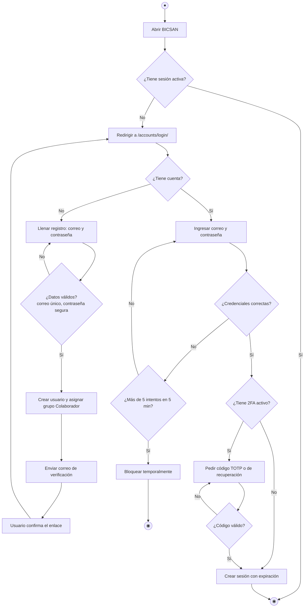
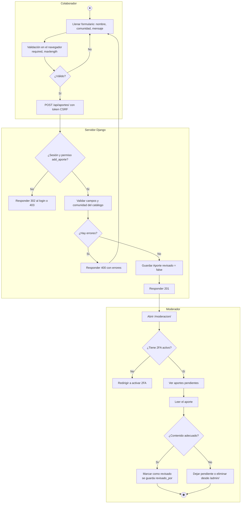

# UML · Diagramas de Actividades

## 1. Registro, inicio de sesión y 2FA

```mermaid
flowchart TD
    I((●)) --> A1[Abrir BICSAN]
    A1 --> D1{¿Tiene sesión activa?}
    D1 -- Sí --> FIN1((◉))
    D1 -- No --> A2[Redirigir a /accounts/login/]
    A2 --> D2{¿Tiene cuenta?}
    D2 -- No --> A3[Llenar registro: correo y contraseña]
    A3 --> D3{¿Datos válidos?<br/>correo único, contraseña segura}
    D3 -- No --> A3
    D3 -- Sí --> A4[Crear usuario y asignar grupo Colaborador]
    A4 --> A5[Enviar correo de verificación]
    A5 --> A6[Usuario confirma el enlace]
    A6 --> A2
    D2 -- Sí --> A7[Ingresar correo y contraseña]
    A7 --> D4{¿Credenciales correctas?}
    D4 -- No --> D5{¿Más de 5 intentos en 5 min?}
    D5 -- Sí --> A8[Bloquear temporalmente] --> FIN2((◉))
    D5 -- No --> A7
    D4 -- Sí --> D6{¿Tiene 2FA activo?}
    D6 -- No --> A10[Crear sesión con expiración]
    D6 -- Sí --> A9[Pedir código TOTP o de recuperación]
    A9 --> D7{¿Código válido?}
    D7 -- No --> A9
    D7 -- Sí --> A10
    A10 --> FIN1
```

## 2. Enviar y moderar un aporte

```mermaid
flowchart TD
    subgraph COL["Colaborador"]
        I((●)) --> B1[Llenar formulario: nombre, comunidad, mensaje]
        B1 --> B2[Validación en el navegador<br/>required, maxlength]
        B2 --> D1{¿Válido?}
        D1 -- No --> B1
        D1 -- Sí --> B3[POST /api/aportes/ con token CSRF]
    end

    subgraph SRV["Servidor Django"]
        B3 --> C1{¿Sesión y permiso add_aporte?}
        C1 -- No --> C2[Responder 302 al login o 403]
        C1 -- Sí --> C3[Validar campos y comunidad del catálogo]
        C3 --> D2{¿Hay errores?}
        D2 -- Sí --> C4[Responder 400 con errores] --> B1
        D2 -- No --> C5[Guardar Aporte revisado = false]
        C5 --> C6[Responder 201]
    end

    subgraph MOD["Moderador"]
        C6 --> M1[Abrir /moderacion/]
        M1 --> D3{¿Tiene 2FA activo?}
        D3 -- No --> M2[Redirigir a activar 2FA]
        D3 -- Sí --> M3[Ver aportes pendientes]
        M3 --> M4[Leer el aporte]
        M4 --> D4{¿Contenido adecuado?}
        D4 -- Sí --> M5[Marcar como revisado<br/>se guarda revisado_por]
        D4 -- No --> M6[Dejar pendiente o eliminar desde /admin/]
        M5 --> FIN((◉))
        M6 --> FIN
    end
```
