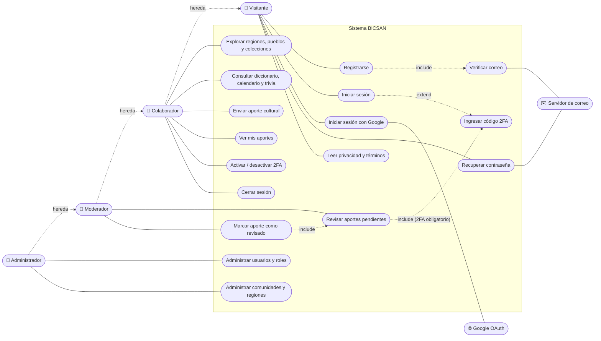

# UML · Diagrama de Casos de Uso

Actores del sistema y lo que cada uno puede hacer. Los roles se heredan:
un Moderador también es Colaborador, y el Administrador puede hacer todo.

## Descripción de actores

| Actor | Quién es | Permisos |
|---|---|---|
| **Visitante** | Persona sin sesión | Solo registro, inicio de sesión, recuperación y páginas legales. |
| **Colaborador** | Toda cuenta nueva (grupo asignado automáticamente) | Explorar todo el contenido, enviar aportes (`aportes.add_aporte`), ver sus aportes y gestionar su 2FA. |
| **Moderador** | Grupo asignado por un administrador | Lo anterior y además revisar aportes (`aportes.revisar_aporte`, `aportes.view_aporte`). Debe tener 2FA activo. |
| **Administrador** | Superusuario de Django | Acceso completo al panel `/admin/`: usuarios, grupos, comunidades y regiones. |
| **Google OAuth** | Sistema externo | Autentica a usuarios que eligen "Continuar con Google". |
| **Servidor de correo** | Sistema externo (SMTP) | Envía verificación de correo y recuperación de contraseña. |

## Casos de uso principales

| ID | Caso de uso | Precondición | Resultado |
|---|---|---|---|
| UC1 | Registrarse | Sin sesión | Cuenta creada en el grupo *Colaborador*; se envía correo de verificación. |
| UC9 | Enviar aporte | Sesión iniciada y permiso `add_aporte` | Aporte guardado como *pendiente* (`revisado = false`). |
| UC11 | Activar 2FA | Sesión iniciada | Autenticador TOTP vinculado y códigos de recuperación generados. |
| UC13 | Revisar aportes | Rol *Moderador* y 2FA activo | Lista de aportes pendientes. |
| UC14 | Marcar revisado | Igual que UC13 | `revisado = true` y `revisado_por = moderador`. |
