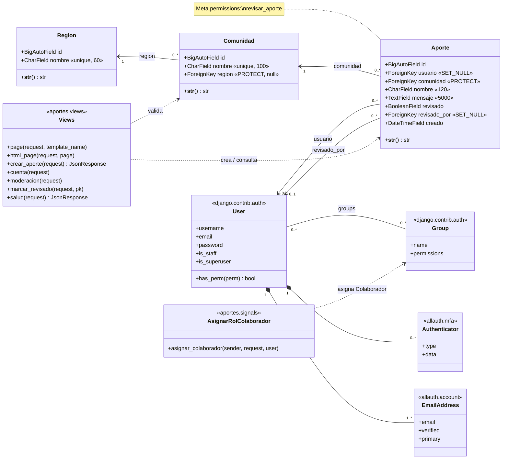

# UML · Diagrama de Clases

Clases del dominio (`aportes/models.py`), las vistas que las usan y las clases
de Django/allauth con las que se relacionan.

## Responsabilidades

| Clase | Responsabilidad |
|---|---|
| `Region` | Catálogo de las 4 regiones de Nicaragua. |
| `Comunidad` | Catálogo de pueblos; cada uno pertenece a una región (o a ninguna si está en todo el país). |
| `Aporte` | Contribución cultural enviada por un usuario y su estado de revisión. |
| `Views` | Reciben las peticiones HTTP, comprueban sesión y permisos, validan datos y responden HTML o JSON. |
| `AsignarRolColaborador` | Al registrarse un usuario, lo agrega al grupo *Colaborador*. |
| `User` / `Group` | Autenticación y roles (Django). |
| `Authenticator` | Segundo factor TOTP y códigos de recuperación (allauth.mfa). |
| `EmailAddress` | Correos del usuario y su verificación (allauth). |
